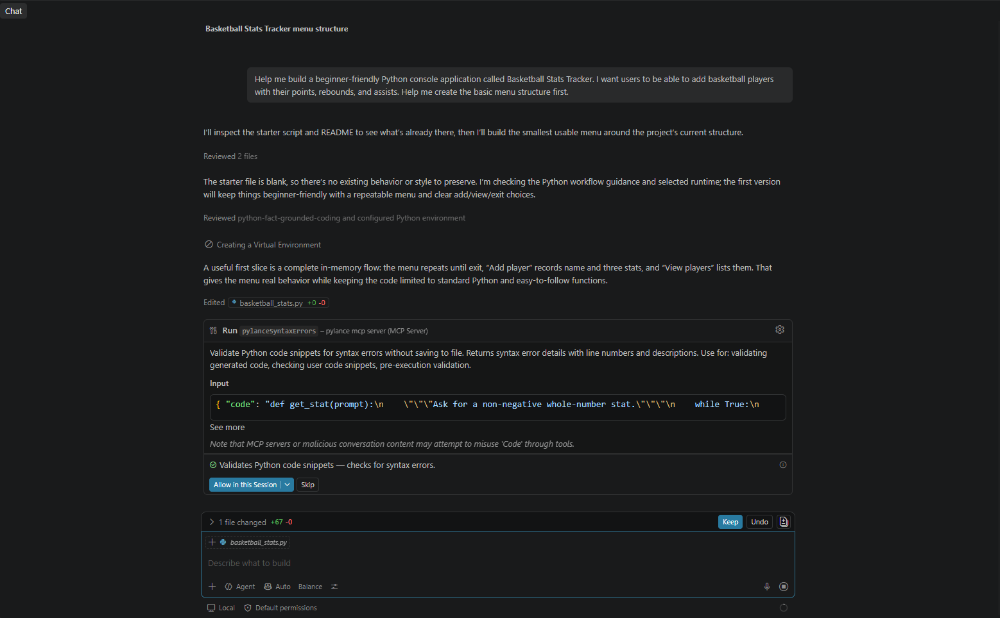

1. What did you ask Copilot to help you build? How did you break down the problem?

I asked GitHub Copilot to help me build a beginner-friendly Python console application called Basketball Stats Tracker. The goal was to create a program where users could add basketball players and record their points, rebounds, and assists. Instead of asking Copilot to create the entire project at once, I started by asking it to create the basic menu structure. Copilot created options for adding players, viewing players, and exiting the program. After testing the basic version, I asked Copilot to add support for multiple games and calculate each player's average points, rebounds, and assists. Breaking the project into smaller features made it easier for me to test each part and understand how the program was changing.
[screenshot2](screenshots/copilot-2.png)[screenshot3](screenshots/copilot-3.png)

2. How did your approach to asking questions change as you worked?

At the beginning, my prompt wasn't that specifc because I wanted Copilot to help me create the basic structure of the application. I asked for a beginner-friendly Basketball Stats Tracker with a basic menu. After I had a working version, my prompts became more specific. Instead of asking Copilot to make the whole application, I asked it to add one feature at a time. For example, I asked it to support multiple games for each player and calculate average points, rebounds, and assists. I learned that giving Copilot a clear and focused request made its responses easier to understand and test.
screenshots^

3. What parts of the development process with GitHub Copilot surprised you?

I was surprised by how quickly Copilot could take a description of a feature and turn it into working Python code. When I asked it to add support for multiple games, it updated the data structure, added another menu option, and calculated the averages. I also liked that it could work with the code that was already in the project instead of starting over. However, I still needed to run the program myself and make sure the results were correct. This showed me that Copilot can speed up development, but testing the code is still important.

4. What did you learn about the technology you used that you didn't know before?

I learned more about how Python can organize related information using lists and dictionaries. Each player can have a name and a list of games, while each game contains points, rebounds, and assists. I also learned how Python can calculate averages using `sum()` and the number of games recorded. Another thing I learned was how input validation can use `try` and `except` to prevent the program from crashing when someone enters something other than a whole number. Building the application helped me see how these Python features can work behind the scenes together in a real program.

5. What would you do differently if you had to build this again?

If I were to build this project again, I would plan the features before I started coding. I would decide how player and game information should be stored and then build and test each feature separately. I would also make my prompts to Copilot more specific from the beginning because I learned that detailed prompts usually produce more useful results. If I had more time, I would also add a way to save the basketball statistics to a file so that the information would still be available after the program closes.